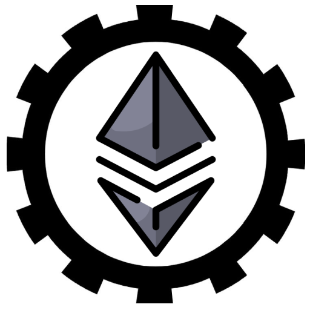

# Re-Akula

re-Akula is a passion-driven side project initiated by two developers, [Bartick](https://github.com/bartick) and [Tamaghna](https://github.com/RazorClient), who are deeply interested in exploring the complexities of Ethereum client software. 
With an ambitious goal of building a lightweight Ethereum client entirely in Rust, this project represents more than just a technical endeavor—it is a means of gaining profound insights into the architecture of Ethereum clients and contributing meaningfully to the broader blockchain ecosystem.

## Project Namesake

The project is named after the Akula-class submarine, a symbol of stealth and power. Just as the Akula-class submarine is designed to operate silently and effectively in the depths of the ocean, re-Akula is designed to operate efficiently and securely in the depths of the Ethereum network. 

## Inspriration
The project is heavily inspired by by [Akula](https://github.com/akula-bft/akula),form where it derives its namesake from .
Other projecdts that have lead us to develop this is 
- RETH(https://github.com/paradigmxyz/reth/tree/main)
- Lighthouse(https://github.com/sigp/lighthouse)
- Helios(https://github.com/a16z/helios)
- Portal Network (https://ethportal.net/)
- Smol Dot (https://github.com/smol-dot/smoldot)

## Design Motivation 

The software is to be modular and to have simplicity while also being efficient

## Deadlines

The first release is to be somewhere in the month of feb-march 
A complete working client is desired before the 6th epf cohort as this serves as our demo project for epf cohort 6 and also eth intership 